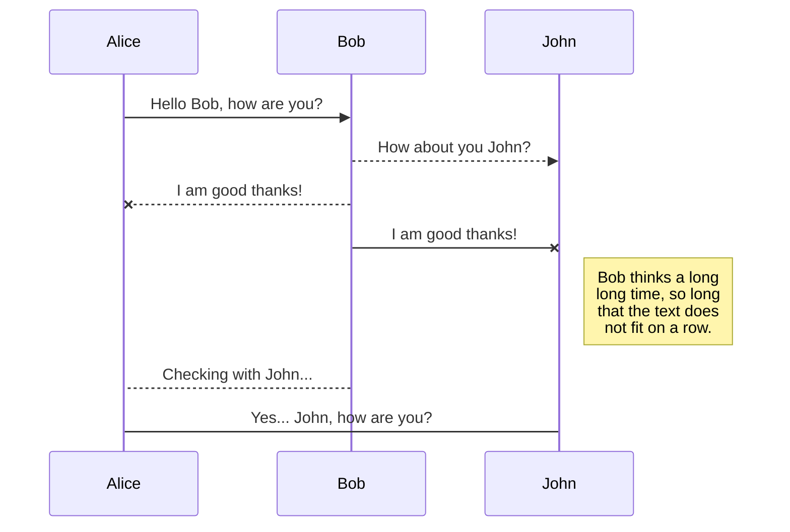

# nodeppt 3.0 (a modernized nodeppt 2.0)

> It is exhausting to do PPT！<br/> > **View the results：https://nodeppt.js.org**

[](https://www.npmjs.com/package/nodeppt)

**nodeppt 3.0** Based on [webslides](https://github.com/webslides/WebSlides)、webpack、markdown-it、posthtml refactoring，[NodePPT](https://nodeppt.js.org)

## Install

```bash
npm install -g nodeppt
```

## Usage

Simplified, just three commands：

-   new：Create a new md file using the online template
-   serve：Start a webpack dev server with an md file
-   build：Compile and generate an md file

```bash
# create a new slide with an official template
$ nodeppt new slide.md

# create a new slide straight from a github template
$ nodeppt new slide.md -t username/repo

# start local sever show slide
$ nodeppt serve slide.md

# to build a slide
$ nodeppt build slide.md
```

### Help

```bash
# help
nodeppt -h
# get help
nodeppt serve -h
```

## Speaker Mode

nodeppt has a speaker mode. Adding `?mode=speaker` after the page url can turn on the speaker mode and synchronize the two screens.

## Keyboard Shortcuts

-   Page: ↑/↓/←/→ Space Home End
-   Fullscreen: F
-   Overview: -/+
-   Speaker Note: N
-   Grid Background: Enter

## Public resources: public folder

If there is a `public` folder in the project folder, you can access it directly through the url. Refer to the `contentBase` option of `webpack dev server`.

During `build`, all files in the public folder will be copied to the `dist` folder.

## Write

The best experience is the Chrome browser, which is originally used for demonstration, but don’t worry about compatibility with non-Chrome browsers!

Here is how to write.

### Basic Syntax

The entire markdown file is divided into two parts. The first part is the **configuration** written at the front, and then the content of each slide separated by `<slide>`.

### Configuration

The configuration of nodeppt is written directly at the top of the md file, using yaml syntax, for example, the following configuration:

```yaml
title: nodeppt markdown demo
speaker: speaker's name
url: https://github.com/vanHeemstraSystems/presentation-management
js:
    - https://www.echartsjs.com/asset/theme/shine.js
prismTheme: solarizedlight
plugins:
    - echarts
    - katex
```

-   title: Speach Topic
-   speaker：Speaker's Name
-   url：URL
-   js：js file array, put it before body
-   css：css file array, put it in the head
-   prismTheme：prism color scheme, value range: `['dark', 'coy', 'funky', 'okaidia', 'tomorrow', 'solarizedlight', 'twilight']`
-   plugins：Currently nodeppt supports 3 plugins: [charts](https://echarts.baidu.com/), [flowchart mermaid](https://mermaidjs.github.io/), [mathematical symbols KaTeX](https://katex.org).
-   pluginsOptions：Plugin Configuration
-   webslidesOptions：[webslides](https://github.com/webslides/WebSlides/wiki/Core-API#options) Configuration

**webslidesOptions corresponds to the configuration of webslides, such as turning on `autoslide`**：

```yaml
webslidesOptions:
    autoslide: 5000
```

#### Plugins

Currently nodeppt supports 3 plugins: [charts](https://echarts.baidu.com/), [flowchart mermaid](https://mermaidjs.github.io/), [mathematical symbols KaTeX](https://katex.org).

#### echarts

The echarts theme color can be directly introduced in the js configured by `yaml`. echarts uses the `fence` syntax, as follows:

```echarts
{
    xAxis: {
        type: 'category',
        data: ['Mon', 'Tue', 'Wed', 'Thu', 'Fri', 'Sat', 'Sun']
    },
    yAxis: {
        type: 'value'
    },
    series: [{
        data: [820, 932, 901, 934, 1290, 1330, 1320],
        type: 'line'
    }]
}
```

For details, see [site/echarts.md](./site/echarts.md)

#### mermaid

The mermaid theme color can be directly introduced in the js configured in `yaml`. mermaid uses the `fence` syntax, as follows:



See [site/mermaid.md](./site/mermaid.md) for details

#### ketex

Reference: [markdown-it-katex](https://www.npmjs.com/package/markdown-it-katex) syntax

### `<slide>` syntax

nodeppt will split the entire markdown file into single-page slides based on `<slide>`. The `<slide>` tag supports the following tags：

-   class/style, etc.: Normal class, you can use this to control centering (aligncenter), content position, background color, etc.
-   image: background image, basic syntax `image="img_url"`
-   video: background video, basic syntax `video="video_src1,video_src2"`
-   :class: wrap class, detailed below

Each slide will be parsed into the following html structure:

```html
<section class="slide" attrs...><div class="wrap" wrap="true">// Specific markdown rendered content</div></section>
```

The `class` of `<slide>` will be parsed to the `<section>` tag, and `:class` will be parsed to `div.wrap`, for example:

```html
<slide :class="size-50" class="bg-primary"></slide>
```

The output is:

```html
<section class="slide bg-primary"><div class="wrap size-50" wrap="true">// Specific markdown rendered content</div></section>
```

#### Background: Image

`image` of `<slide>` will be parsed as a background image. Common supported methods are:

```md
<slide image="https://source.unsplash.com/UJbHNoVPZW0/">

# This is a normal background image

<slide image="https://source.unsplash.com/UJbHNoVPZW0/ .dark">

# This background image will cover the image with a black transparent layer

<slide image="https://source.unsplash.com/UJbHNoVPZW0/ .light">

# This background image will cover the image with a white transparent layer

<slide class="bg-black aligncenter" image="https://source.unsplash.com/n9WPPWiPPJw/ .anim">

# This background image will move slowly
```

See [site/background.md](./site/background.md) and [online demo](https://js8.in/nodeppt/background.html) for details.

### Style

There are too many styles, please see [site/classes.md](./site/classes.md) and [online demo](https://js8.in/nodeppt/classes.html) for details

### Layout

nodeppt This time uses the layout of `webslides`, which supports a variety of layouts. There are too many to list. Just look at the document [site/layout.md](./site/layout.md) and [online demo](https://js8.in/nodeppt/layout.html)

### Attribute

Refer to [markdown-it-attrs](https://www.npmjs.com/package/markdown-it-attrs), which supports `attribute` and adds multiple class support.

Among them: `..class` will add a class to the previous level node, and supports the syntax of multiple classes such as `{.class1.class2}`. Usage examples:

```markdown
# header {.style-me.class2}

paragraph {data-toggle=modal}
```

Output:

```html
<h1 class="style-me class2">header</h1>
<p data-toggle="modal">paragraph</p>
```

```markdown
Use the css-module green on this paragraph. {.text-intro}
```

Output:

```html
<p class="text-intro">Use the css-module green on this paragraph.</p>
```

```markdown
-   list item **bold** {.red}
```

Output:

```html
<ul>
    <li class="red">list item <strong>bold</strong></li>
</ul>
```

```markdown
-   list item **bold**
    {.red}
```

Output:

```html
<ul class="red">
    <li>list item <strong>bold</strong></li>
</ul>
```

### Image Enhancement

For image, it supports wrapping a layer of text outside. The specific syntax is `!`, for example:

```markdown
!
```

Output：

```html

```

```markdown
!
```

Output:

```html
<figure></figure>
```

### Button

The button of nodeppt is similar to the `link` syntax, and supports blue, rounded, hollow and icon versions of buttons:

```markdown
[Normal button](){.button} [Rounded normal button](){.button.radius}

[hollow](){.button.ghost} [:fa-github: with icon in front](){.button}
```

### Icon：FontAwesome

Nodeppt's icon supports [FontAwesome](https://fontawesome.com/) Syntax:

-   `:fa-xxx:` → `<i class="fa fa-xxx"></i>`
-   `:~fa-xxx:~` → `<span><i class="fa fa-xxx"></i></span>`
-   `::fa-xxx::` → block-level `<i class="fa fa-xxx"></i>`, that is, it will not be wrapped by `p`

### Span

The code is modified from [markdown-it-span](https://github.com/pnewell/markdown-it-span/), supports `attr` syntax, basic usage:

```md
:span:
:span: {.text-span}
```

### Animation

nodeppt supports animation as always. Version 2.0 supports animations mainly within the page.

Supported animations include:

-   fadeIn
-   zoomIn
-   rollIn
-   moveIn
-   fadeInUp
-   slow

Just add `.build` to the parent node of the animation that needs to be supported, or add `.tobuild+animation class` to a specific element.

As usual, nodeppt also supports the animation effects of `animate.css`~

See the file for details: [site/animation.md](./site/animation.md) and [online demo](https://js8.in/nodeppt/animation.html)

### Use powerful `:::` to complete complex layout

The `:::` syntax is an extension of the [markdown-it-container](https://www.npmjs.com/package/markdown-it-container) syntax. The default is any tag, for example

```markdown
:::div {.content-left}

## Title

:::
```

Output：

```html
<div class="content-left"><h2>title</h2></div>
```

It also supports nested `tag`. In addition, the supported components include:

-   card: a card with a picture on one side and content on the other
-   column: column multi-column layout
-   shadowbox: box with shadow
-   steps: step component
-   cta：
-   gallery: pictures
-   flexblock: flex block layout, supports multiple subtypes

The **basic syntax** is:

```markdown
:::TYPE {.attrs}

## Part 1

Use hr tags to separate

---

## Part 2

The content here is also

:::
```

For details, please see the markdown file in the [component](./site/component.md) section and the [online demo](https://js8.in/nodeppt/component.html)

## Print? Export to pdf?

In the Chrome browser, add `URL?print-pdf` to the URL, then simply press `command+P/ctrl+P` to select print!

## Advanced gameplay

If the above

### `nodeppt.config.js`

Create a `nodeppt.config.js` file in the nodeppt execution path to configure options related to `webpack` and support self-developed nodeppt plug-ins.

The default built-in `config.js` content is as follows:

```js
/**
 * @file default configuration
 */
module.exports = () => ({
    // project deployment base
    baseUrl: '/',

    // where to output built files
    outputDir: 'dist',

    // where to put static assets (js/css/img/font/...)
    assetsDir: '',

    // filename for index.html (relative to outputDir)
    indexPath: 'index.html',
    // Plug-ins, including markdown and posthtml
    plugins: [],
    // chainWebpack: [],

    // whether filename will contain hash part
    filenameHashing: true,

    // boolean, use full build?
    runtimeCompiler: false,

    // deps to transpile
    transpileDependencies: [
        /* string or regex */
    ],

    // sourceMap for production build?
    productionSourceMap: true,

    // use thread-loader for babel & TS in production build
    // enabled by default if the machine has more than 1 cores
    parallel: () => {
        try {
            return require('os').cpus().length > 1;
        } catch (e) {
            return false;
        }
    },

    // multi-page config
    pages: undefined,

    // <script type="module" crossorigin="use-credentials">
    // #1656, #1867, #2025
    crossorigin: undefined,

    // subresource integrity
    integrity: false,

    css: {
        extract: true,
        // modules: false,
        // localIdentName: '[name]_[local]_[hash:base64:5]',
        // sourceMap: false,
        // loaderOptions: {}
    },

    devServer: {
        /*
      host: '0.0.0.0',
      port: 8080,
      https: false,
      proxy: null, // string | Object
      before: app => {}
    */
    },
});
```

### Parser plugin

Parsing plugins are divided into two categories: `markdown-it` and `posthtml`.

-   markdown-it: parses markdown files. If you want to enhance the markdown syntax, you can use this type of plug-in
-   posthtml: It processes html tags. If you want to modify the output html content, you can use this type of plug-in

Define a plugin:

```js
module.exports = {
    // The id here must start with markdown/posthtml
    // Corresponding to markdown-it and posthtml plugin syntax respectively
    id: 'markdown-xxx',
    // Here apply is the actual content of the plugin. For details, see markdown-it and posthtml plugin development
    apply: () => {},
};
```

-   [markdown-it docs](https://github.com/markdown-it/markdown-it/tree/master/docs)
-   [posthtml docs](https://github.com/posthtml/posthtml/tree/master/docs)

### Webslides plugin

The WebSlides plugin needs to be written into a js file and then put into `window.WSPlugins_` as an array, and then introduced by adding the js method in the md page configuration (yaml).

```md
js: - webslide_plugins.js
```

```js
// webslide_plugins.js Contents
window.WSPlugins_ = [
    {
        id: 'webslide_plugin_name',
        // The following is the corresponding plugin class
        apply: class Plugin {},
    },
];
```

Refer to the [WebSlides documentation](https://github.com/webslides/WebSlides/wiki/Plugin-development)

### Template: Custom template

Download [nodeppt-template-default](https://github.com/vanHeemstraSystems/nodeppt-template-default).

Then use `nodeppt new username/repo xxx.md` to use, for example: `nodeppt new vanHeemstraSystems/presentation-management templates/default.md`

## Thanks

-   [WebSlides](https://github.com/webslides/WebSlides)
-   [markdown-it](https://github.com/markdown-it/markdown-it)
-   [posthtml](https://github.com/posthtml/posthtml)
-   [webpack](https://github.com/webpack/webpack)
-   [vue-cli](https://github.com/vuejs/vue-cli)